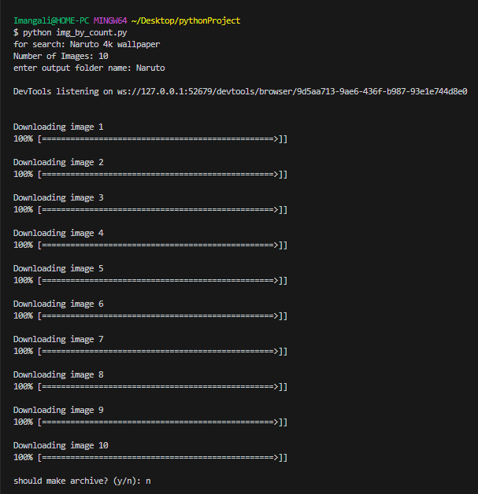

# Educational Project: Image Scraper using Selenium

Hey there! This project is designed to understand how to use Selenium in Python to create a simple image scraper. With the help of this scraper, you'll be able to download images from a yandex image for use as wallpapers or for other educational purposes.

## Installation and Setup

1. Make sure you have Python installed. It's recommended to use Python 3.6 or newer.

1. Install the necessary libraries by running the command: `pip install -r requirements.txt`

## Usage

1. Run the script by executing the command: `python img_by_count.py [or main.py]`

1. The script will open the browser, perform a search, and download the specified number of images. The downloaded images will be saved in the `Desktop` folder.

## Screenshots

## Notes

- Feel free to enhance the script to add additional features, such as automatically resizing images or saving in different formats.

---

Feel free to make any changes to this README.md to suit your project. Good luck with your coding adventures! 😄🚀

